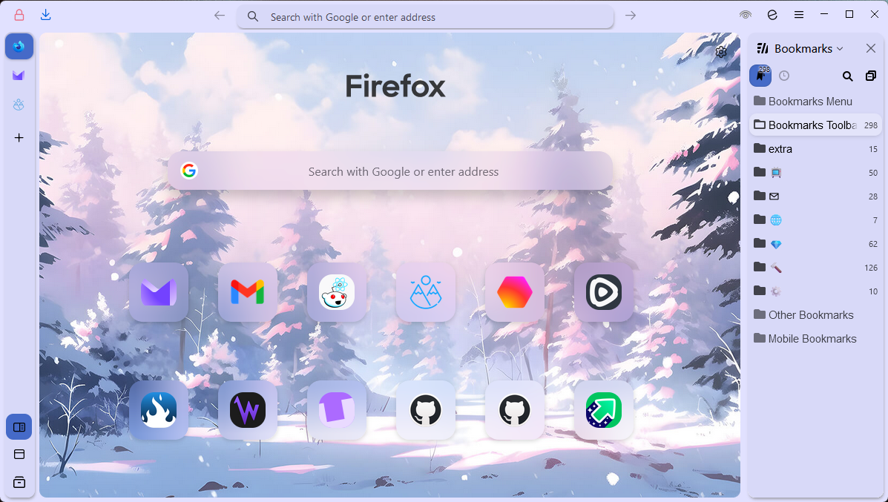
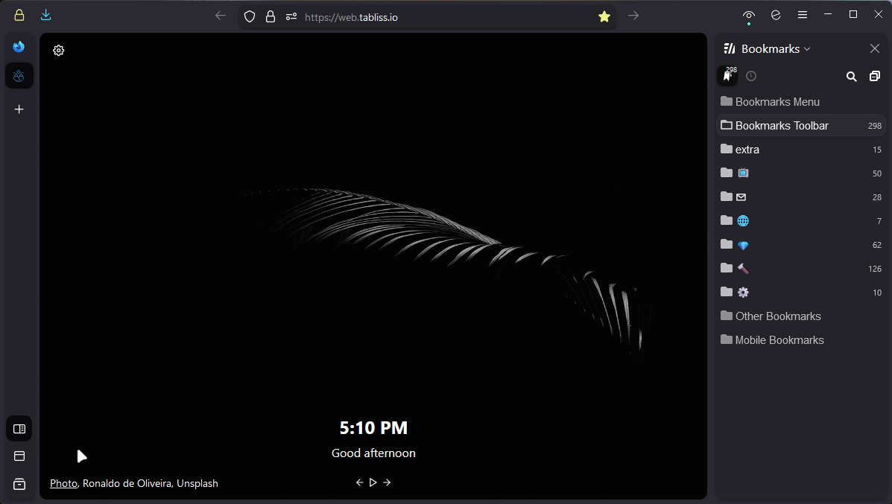

# 
 FF ULTIMA... 

###### 
. . . a sequel to [Perfection FF CSS Theme](https://github.com/soulhotel/Perfection-Firefox-CSS-Theme) 

###### 
Beautiful. light-weight. a 100% easy-mode theme. and a 100% over-the-top name to break the fourth wall!

  

## Features

- `Vertical Tabs` and a `One Line Nav Bar`
- Support to create color schemes, or just go to the addon store
- Full Moon (Dark) and Dusky (Light) cycle depending on your Systems current color mode
- New Tab Page Overhaul. [@hachikoharuno](https://github.com/hachikoharuno/Beautiful-newtab-Firefox) 
- Multiple Options - for Tab Size, Autohiding Tabs, Sidebar, Spacing, [and More](doc/Modification.md)
- The Mini Button Bar - pin/unpin up to 15 buttons, drag and drop functional. Works with the following buttons:

## Requirements

- ✅ Firefox 120+
- ✅ Win11/Lin/Mac

(Click me) Have system theme enabled for first install, not firefox dark/light, they are different.

  
 

(Click me) Need help finding your Profile Folder?

 

> userChrome Themes work by Having the Browser read stylized `.css text files` in a certain directory within your Profile Folder. There are two easy ways to locate this folder:

1. Go to the `about:support` page
- In the URL Bar, type `about:support`.
- Look at the **Profile Folder** row. Open the folder.
- In that folder, create a new folder named `chrome` (If it doesnt already exist).

2. Go to the `about:profiles` page
- In the URL Bar, type `about:profiles`.
- Your profile will say `This is the profile in use and...`. Click the **Open Directory** button in the **Root Directory** row.
- In that folder, create a new folder named `chrome` (if it doesnt already exist).
 

## Installation

###### :warning: There are 2 ways to install this theme, both have their drawbacks and strengths. Choose one.

> [!IMPORTANT]
> ### The Easy Way:
> 1. Download the latest version by [clicking here](https://github.com/soulhotel/FF-ULTIMA/archive/refs/heads/main.zip). Or on the [release page.](https://github.com/soulhotel/FF-CSS-ULTIMA/releases/latest)
> 2. In the theme zip file, copy the files from `ffultimax.x.x` folder into the chrome folder.
> 3. In the chrome folder youll see a file named `user.js`, move it out of the chrome folder and into the Profile Folder.
> 4. Restart Firefox. After Firefox is open again, delete the `user.js` file.
> 5. The `user.js` file enabled userChrome, and added theme settings like tab size, autohiding, etc, in the `about:config` page.
> 6. Try it out, go to `about:config` then search for `ultima`.

<!-- https://github.com/soulhotel/FF-ULTIMA/assets/155501797/dbc7fc96-e975-4a6f-820d-f69efa04cf8e -->

> [!warning]
> ### The Hard Way:
> ###### 🔄 This method involves using Git and the Terminal - allowing easier updates. Harder for the less technical of people.
> 1. Open a terminal in your Profiles `chrome` folder.
> 2. In the terminal, navigate to your profile folder path `cd your\profile\folder\path`.
> 3. In the terminal: `git clone https://github.com/soulhotel/FF-ULTIMA.git` to clone/update to the latest version.
> 4. In your chrome folder youll have a file named `user.js`.
> 5. Move the `user.js` file **OUT** of the chrome folder and **INTO** your Profile Folder.
> 6. Restart Firefox. After Firefox is open again, delete the `user.js` file.
> 7. The `user.js` file enabled userChrome, and added theme settings like tab size, autohiding, etc, in the `about:config` page.
> 8. Try it out, go to `about:config` then search for `ultima`.

### Previews

###### Click images for a higher resolution

|            Dusky (Light)            |          Full Moon (Dark)           |
| :---------------------------------: | :---------------------------------: |
|  |  |
|            Add On theme             |            Add On theme             |
|  |  |
|            Add On theme             | Example of view in 2 tab extension  |
|  |  |
|                                     |                                     |

#### Enjoy
