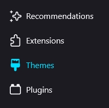
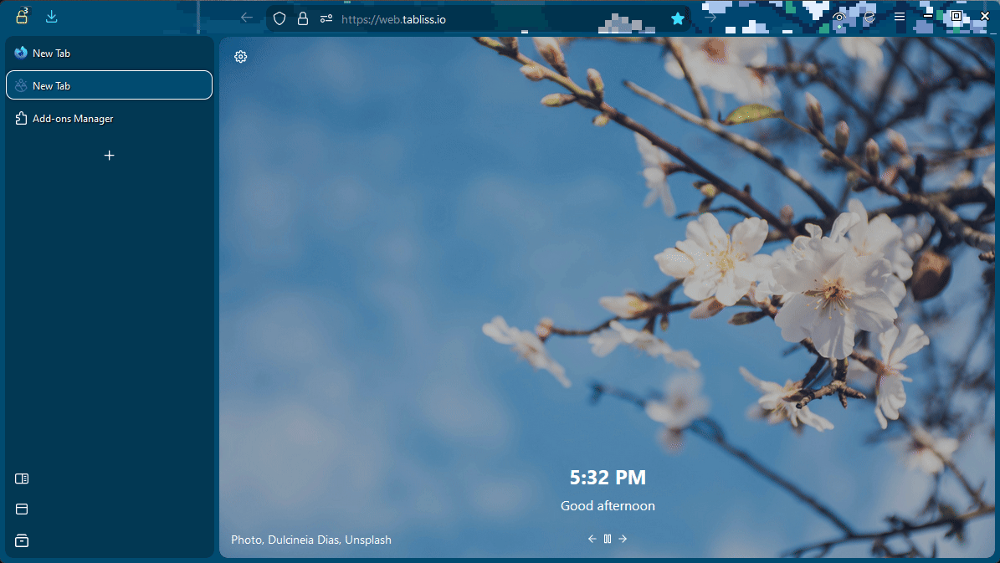
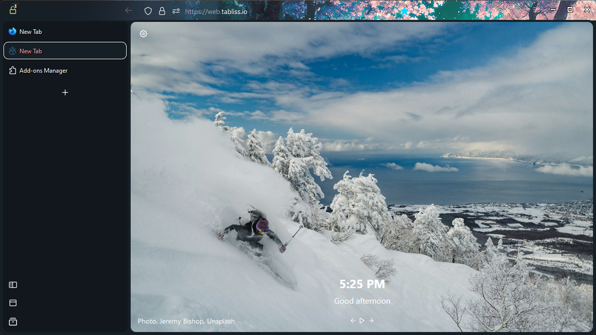
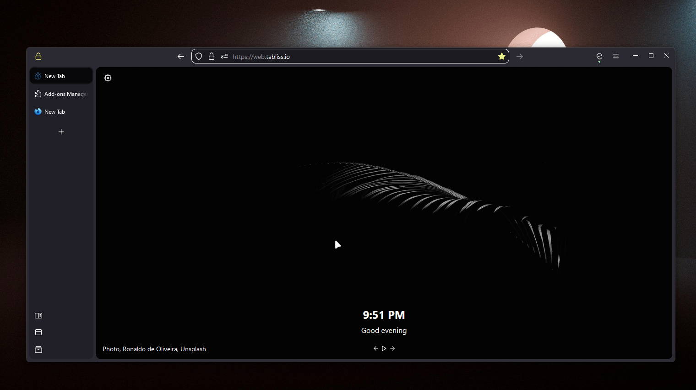

# 
 FF ULTIMA... 

###### 
. . . a sequel to [Perfection FF CSS Theme](https://github.com/soulhotel/Perfection-Firefox-CSS-Theme) 

###### 
Beautiful. light-weight. a 100% CSS theme. and a 100% over-the-top name to break the fourth wall!

  

### Features
► NO extensions used, NO sidebar needed 
► `Vertical Tabs` and a `One Line Nav Bar` 
► Can create your own color schemes, or just go to the addon store 
► Full Moon (Dark) and Dusky (Light) automatically cycle depending on your systems current Color Mode

(NEW) New Tab Overhaul.

  
  ##### [Beautiful-newtab-Firefox](https://github.com/hachikoharuno/Beautiful-newtab-Firefox) is implemented into the theme. So MAJOR Thank You to @hachikoharuno (check out their theme!)
  ###### For full compatibility: goto `about:config` -> search for `svg.context-properties.content.enabled` -> set it to `true`
  

(Click me) choose size of tabs (Optional - 3 Options)

###### Picture only shows two, but there are three options.

(Click me) autohide tabs (Optional - 2 Options)

###### Move content to the side, or tabs overlay content.
  

(Click me) the Mini Button Bar

  ###### pin/unpin up to 15 buttons, drag and drop functional, easily disable by dragging all buttons out. works with the following buttons:

### Installation
###### Firefox 120+ | Win11/Lin/Mac ✅ | User Chrome ✅ [Need help?](https://gist.github.com/soulhotel/80c1ac8d41e45b910158a26d31d48c13) | Follow every step!
► Copy and paste the [Theme](https://github.com/soulhotel/FF-CSS-ULTIMA/releases/latest) into your chrome folder 

(Click me) Have system theme enabled for first install, not firefox dark/light, they are different

  
 

(Click me) Reset toolbar to default buttons

  

► Restart Firefox. 

### Previews
###### Create your own color schemes live, in debugging tool. Use the [Modifications Page](https://github.com/soulhotel/FF-CSS-ULTIMA/blob/main/Modification.md)

##### [Modifications Page](https://github.com/soulhotel/FF-CSS-ULTIMA/blob/main/Modification.md)
##### Enjoy.
