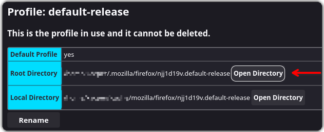
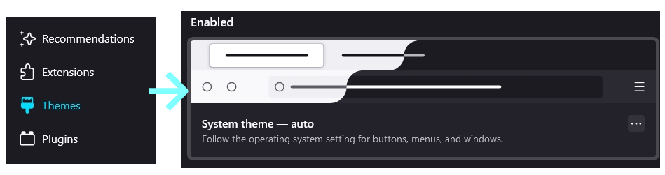

# <p align="center"> FF ULTIMA... </p>

###### <p align="center">. . . A theme with too many options. And a sequel to [FF Perfection CSS](https://github.com/soulhotel/Perfection-Firefox-CSS-Theme).</p>

<div align="center">

 <!--  -->   

</div>


## Features

- `Vertical Tabs` and a `One Line Nav Bar`.
>
- Add-on theme support, FF ULTIMA can be used with firefox add-on themes.
>
- Color Scheme support, create your own (with Tutorial) or cycle through the many options.
>
- Dark or Light mode themes, automatically cycle depending on your systems current Color Mode.
>
- Windows, Linux and Mac OS Support.
>
- Multiple Options - for Tab Size, Autohiding, Spacing, Tabs on Top/Right, OS compatibility [and More](https://github.com/soulhotel/FF-ULTIMA/wiki/Settings)
>
- The Mini Button Bar - pin/unpin up to 15 buttons, drag and drop functional. Works with the following buttons:


## Installation

###### 🚨 Do not skip the installation instructions! Firefox v131+ Required. 🚨

<details>
<summary>Need help finding your Profile Folder? (Click Me)</summary>

<br>

> userChrome Themes work by communicating with a chrome folder located in your Firefox Profile folder, think of it as your User Interface. This folder typically holds `.css` files with the purpose of customizing elements of the Browser. There are two easy ways to access this folder:

1. Go to the `about:support` page
- In the URL Bar, type `about:support`.
- Look for the **Profile Folder** row. Open the folder.
- In that folder, create a new folder named `chrome` (If it doesnt already exist).


2. Go to the `about:profiles` page
- In the URL Bar, type `about:profiles`.
- Your profile will say `This is the profile in use and...`.
- Look for the **Root Directory** row, and click **Open Directory**.
- In the opened Folder, create a new folder named `chrome` (if it doesnt already exist).
 

</details>

<details>
<summary>Have system theme enabled for first install, not firefox dark/light. (Click Me) </summary>
  

</details>

###### ⬇️ Choose *one* of the installation methods below. ⬇️

<details><summary>The Easy Way</summary>
 
>
1. Download the latest version on the [release page](https://github.com/soulhotel/FF-CSS-ULTIMA/releases/latest).
2. Copy everything in the ffultima(version).zip into your chrome folder.
3. For first time installation, you will need to apply the `user.js` to your profile to access theme settings.
4. In the chrome folder, youll see the `user.js`, move it <ins>out the chrome folder and into the Profile Folder<ins>.
5. Restart Firefox.
6. **Wait** for Firefox to open, then delete the `user.js` file.
7. Go to `about:config` and search for `ultima` to see all of your settings.

###### :warning: You only need to touch the user.js when installing the theme for the first time. It's function is to enable userChrome and add theme settings to the about:config page. Do not copy the user.js file into the Profile Folder <ins>if you are just updating the theme to a new version</ins>. Unless you want all of your saved settings to be reset :). 
</details>

<details><summary>The Hard Way</summary>

>
###### This method involves using Git and the Terminal - allowing easier updates. Harder for the less technical of people.
1. Open a terminal in your Profiles `chrome` folder.
2. Or in the terminal, navigate to your Profiles chrome folder `cd your\profile-folder\chrome`.
3. In the terminal, git clone the repo to install/update to the latest version:
```
# cd your/profile-folder/chrome                            # cd into profile folder
git clone https://github.com/soulhotel/FF-ULTIMA.git       # git clone inside
mv FF-ULTIMA/* FF-ULTIMA/.* .                              # clean up double folder
rmdir FF-ULTIMA                                            # remove the extra folder
```
5. In your chrome folder you'll have a file named `user.js`.
6. Move the `user.js` file <ins>OUT of the chrome folder and INTO your Profile Folder.</ins>
7. Restart Firefox.
8. **Wait** for Firefox to open, then delete the `user.js` file.
9. Go to `about:config` and search for `ultima` to see all of your settings.

###### :warning: You only need to touch the user.js when installing the theme for the first time. It's function is to enable userChrome and add theme settings to the about:config page. Do not copy the user.js file into the Profile Folder <ins>if you are just updating the theme to a new version</ins>. Unless you want all of your saved settings to be reset :).

###### :accessibility: Reading the [release page](https://github.com/soulhotel/FF-CSS-ULTIMA/releases/latest) is always recommended. When new versions of the theme come out - and they include new preferences in the about:config page, you may want to open the new user.js file and compare it to your current settings. You can either add the settings manually in the about:config page... or load your own editted user.js file to add the new settings and keep your old the same way.
</details>


## Documentation

[Wiki](https://github.com/soulhotel/FF-ULTIMA/wiki)
- FAQ
- Theme settings overview
- Sidebery config
- List of Color schemes
- Color scheme creation
- Spreadsheets

## Enjoy
