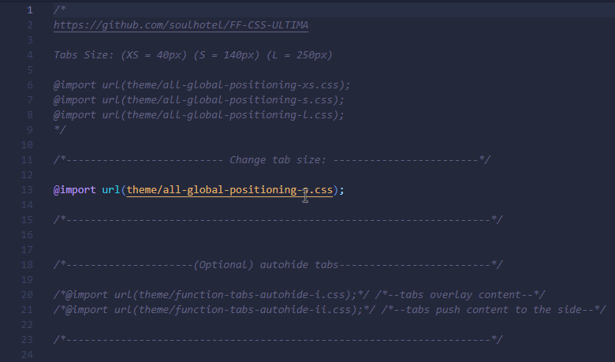
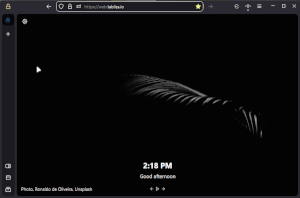
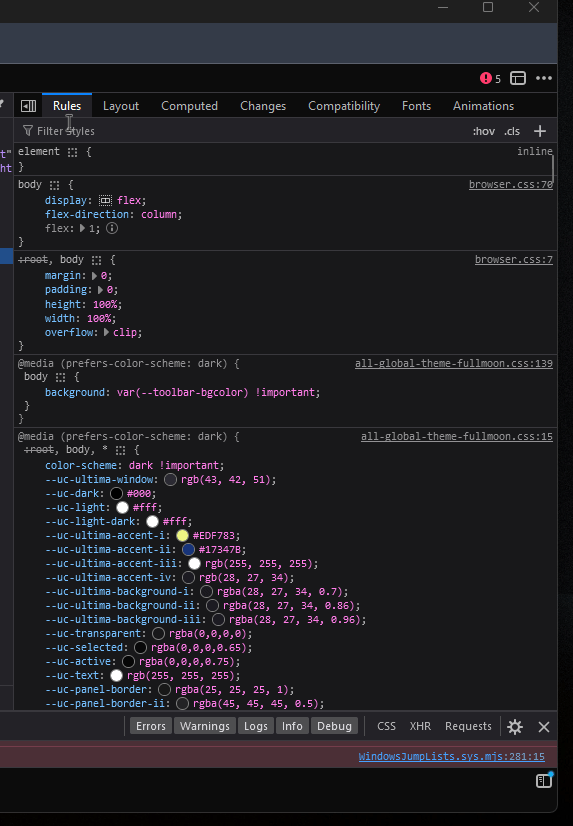

## Modifications

### Settings and Preferences, found on the `about:config` page.

###### IF you cant find what you are looking for, submit an issue or browse the [replace-features.md](replace-features.md)

###### 
(click images for bigger resolution)

| Preferences          | Function            | Preview             |
|----------------------------------|---------------------|---------------------|
| Switching Tab Size               | [XS, 40px TABS] --> `ultima.tabs.xs`   [S, 165px TABS] --> `ultima.tabs.s`   [L, 250px TABS] --> `ultima.tabs.l`   :warning: Set one to true, the others false. |  |
| ultima.tabs.autohide             | Enable/Disable Autohide for tabs. |  |
| ultima.tabs.vertical             | Remove the tabs panel, for users who rather use an extension like sidebery/treestyle. |  |
| ultima.sidebar.autohide          | Autohide the sidebar. Only works when vertical tabs is disabled/turned-off. | ⬆⬆⬆ |
| ultima.xstyle.containertabs      | Three optional styles for container tabs, make your pick. |    |
| ultima.xstyle.squared            | Square the theme; No margins, borders, or rounded corners. |  |
| ultima.theme.extensions          | Extensions-Panel theme, compact-icons or default list-view. |  |
| toolkit.tabbox.switchByScrolling | Enables scrolling on the tabs bar, to switch between tabs | ... |
| ultima.xstyle.closetabsbutton    | Restore visual close button for tabs, works with autohiding on or off, works with closing multiselected tabs |  |
| ... | ... | ... |

---
 

### Sidebery Optional styling

###### [Sidebery configuration](https://github.com/soulhotel/FF-ULTIMA/blob/main/theme/%23sideberyultimastyling.json) for those that want to opt out of the native vertical tabs. You can turn off `ultima.tabs.vertical` in `about:config`, and (if you want to) then turn on `ultima.sidebar.autohide`. Import the config file into your sidebery sync. The config file is also already inside of your chrome/theme folder.

| Sidebery Data                            | Preview                      |
|------------------------------------------|------------------------------|
| `/theme/#sideberyultimastyling.json` |  |

If importing this .json above doesn't copy over the css styling. Try resetting Sidebery to default first, and reloading the add-on. Then import the json.

Optional : you can also copy and paste this [Sidebery CSS](https://github.com/soulhotel/FF-ULTIMA/blob/main/doc/replace-features/style-editor.css) into your Sidebery Style Editor. But this should already be handled by the .json.

---
 

### Switching from Dark Mode to Light Mode

###### This is fully reliant on your systems current Color state. `Personalize - Color Mode` for Windows. `Setting a dark theme like 'Dark Breeze' globally and to windows` for Linux. And Mac follows a similar structure I believe.

---
 

### [Userchrome-Toggle extension](https://addons.mozilla.org/en-US/firefox/addon/userchrome-toggle/) support
With `ultima.tabs.autohide` set to false. And `ultima.tabs.xs` set to true; You can toggle the tabs-view using the extension button, or keyboard shortcut.

[userchrome-toggle test..webm](https://github.com/soulhotel/FF-ULTIMA/assets/44523955/252b3bae-f1c8-41ad-afa7-1e67d7f441cb)

---
 

### Spreadsheets for power users.
<-- [spreadsheets for all variables](https://github.com/soulhotel/FF-ULTIMA/blob/main/doc/spreadsheet-all-ultima-variables.md) (sectioned off by global color modifications, and global positioning modifications)

---
 

### Create a theme. I was able to create Dusky (Light Mode), just like this.
###### You atleast need to have knowledge on what live debugging is to proceed.
###### chrome/theme/all-global-theme-dusky.css , chrome/theme/all-global-theme-fullmoon.css

- Live preview of instructions below
- Make a copy of `all-global-theme-dusky.css`, for a light color scheme
- And/Or a copy of `all-global-theme-fullmoon.css`, for a dark color scheme
- Name your theme file `all-global-theme-dracula.css` ( just an example :/ )
- In userChrome, rename the theme file above with the one you just created
- Open up Live Debugger `ctrl+shift+alt+I`
- Type `--uc-ultima-window` on the right side searchbar for css properties
- Here you will find the full list of all theming variables used
- Start tinkering.
- You can create your theme live and see how the windows, colors, etc, look
- Find color combinations that you like, copy them into your new custom theme file `all-global-theme-dracula.css`
- Congrats! Youve just created a Light Mode theme

  
(Click me) Live Tutorial

  
(Using 'Firefox Colors app' to create themes)

###### Did this in 2 minutes, just showing that it is definitely possible.

---
 

