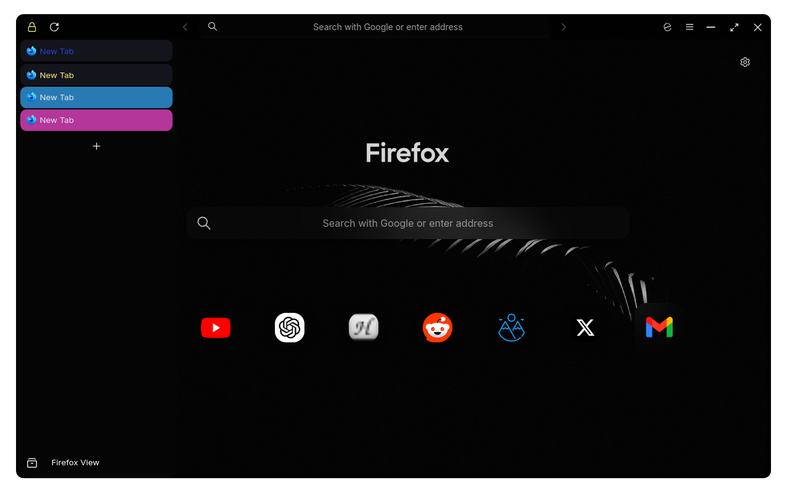

```
FF ULTIMA
Midnight Edition
By FF Ultima
```

To use this color scheme:
- Open `userChrome Companion`, in the `Color Scheme Settings` section.
- Turn on `theme.midnight`

Preview:


https://github.com/user-attachments/assets/d32bb737-6f70-4577-ba6a-81a19aa54f0f

Color schemes are easy to create: Learn how with the [Color Scheme](https://github.com/soulhotel/FF-ULTIMA/wiki/Create-a-Color-Scheme) Wiki.
