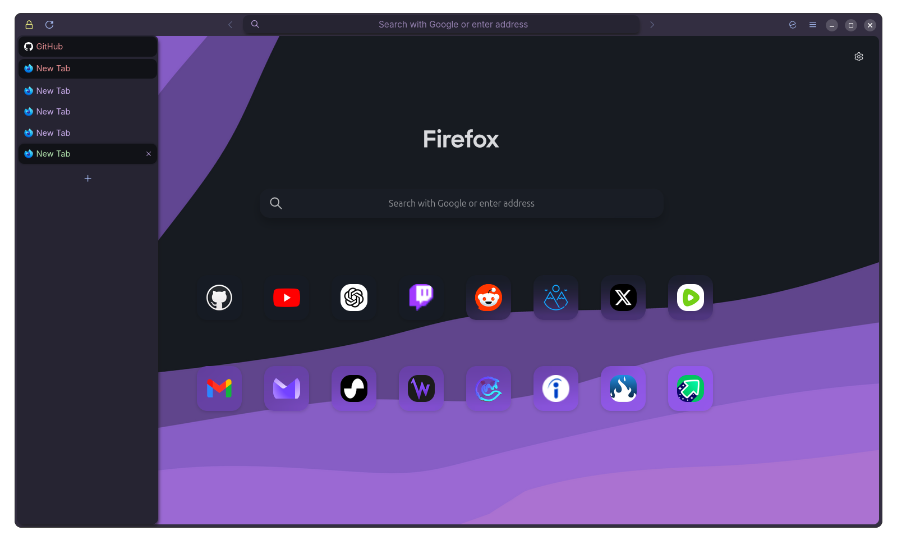

FF ULTIMA
Catppuccin Edition
Dark Mode
By (credit yourself)

To use this color scheme:
- Navigate to `chrome/theme/color-scheme/catppuccin`.
- `Copy the theme folder` located here in the catppuccin folder.
- `Go to back to your chrome folder`.
- `Paste the theme folder` on your chrome folder, allow overwriting.
- `Open your userchrome.css file` which is in the chrome folder.
- Change `all-global-theme-fullmoon.css` to -> `all-global-theme-catppuccin.css`
- Your dark mode will now be catppuccin.
- Enjoy.

Preview:

