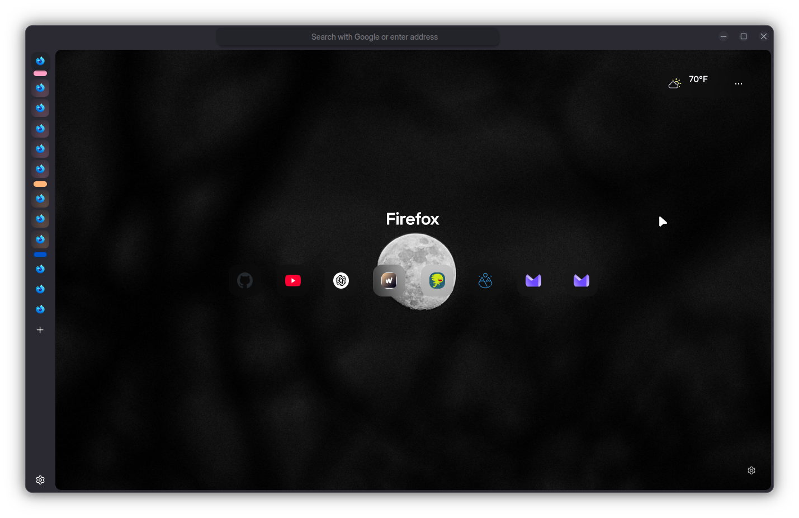
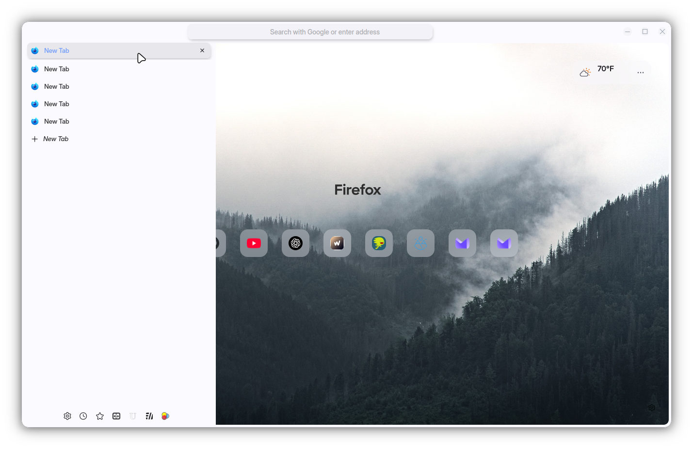

```
FF ULTIMA
Default Edition
By FF ULTIMA
```

To use this color scheme:
- Open `userChrome Companion`, in the `Color Scheme Settings` section.
- Turn on `theme.default`

Preview:



Color schemes are easy to create: Learn how with the [Color Scheme](https://github.com/soulhotel/FF-ULTIMA/wiki/Create-a-Color-Scheme) Wiki.
