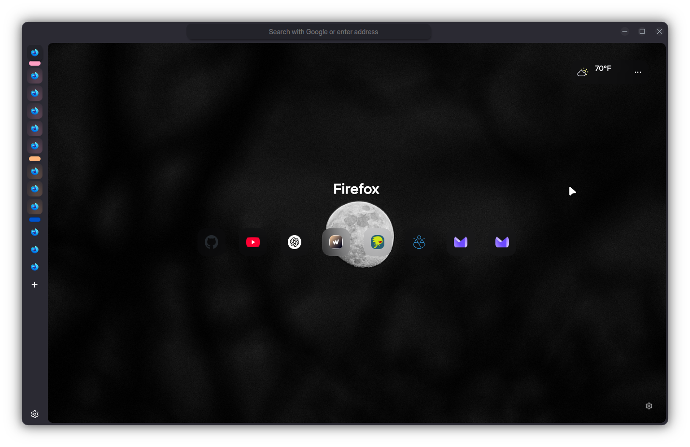
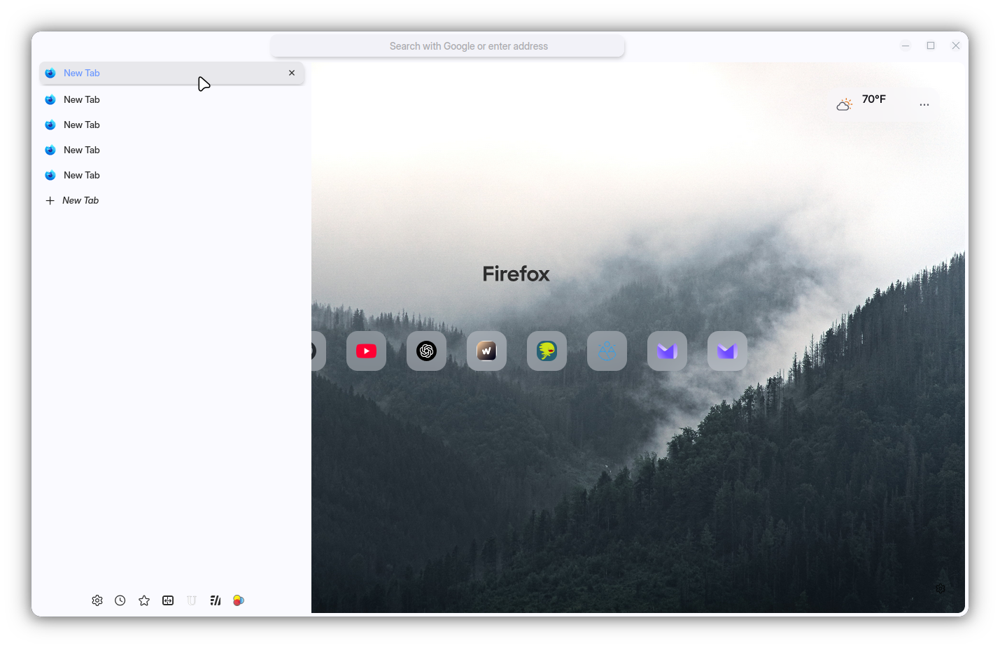

```
FF ULTIMA
Default Edition
By FF ULTIMA
```

To use this color scheme:
- Navigate to `about:config` page.
- Search for `user.theme`.
- Turn on `user.theme.0.default`

Preview:



Color schemes are easy to create: Learn how with the [Color Scheme](https://github.com/soulhotel/FF-ULTIMA/wiki/Create-a-Color-Scheme) Wiki.
