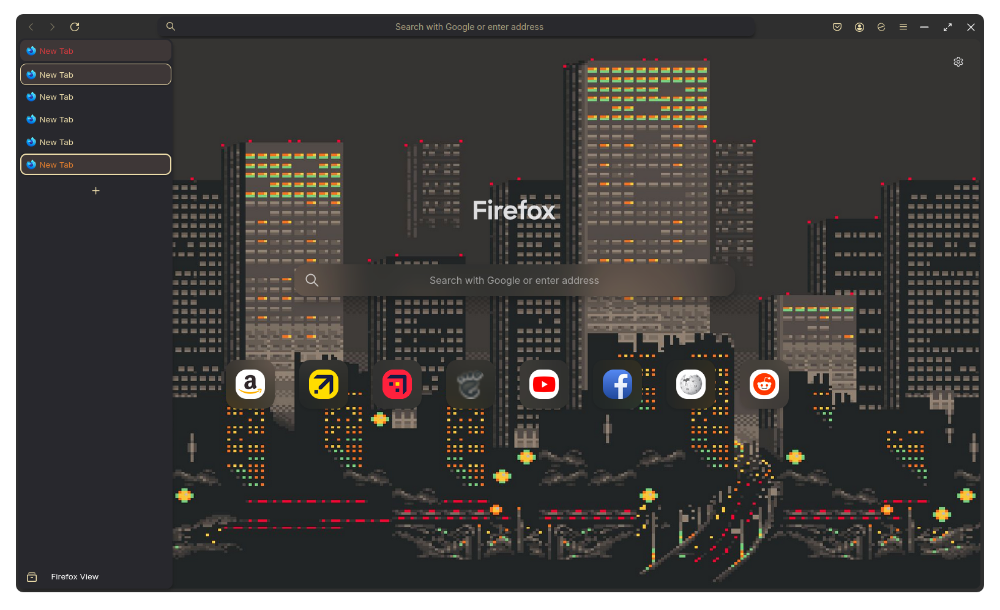

```
FF ULTIMA
Grubbox Edition
Dark Mode
By (credit yourself)
```

To use this color scheme:
- Navigate to `chrome/theme/color-scheme/grubbox`.
- `Copy the theme folder`.
- `Go back <-` to your chrome folder.
- `Paste the theme folder` onto your chrome folder, allow overwriting.
- `Open your userchrome.css file` which is in the chrome folder.
- Change `all-global-theme-fullmoon.css` to -> `all-global-theme-grubbox.css`
- Your dark mode will now be grubbox.
- Enjoy.

Preview:


Color schemes are easy to create: Learn how on the [New Color Scheme](https://github.com/soulhotel/FF-ULTIMA/blob/main/doc/New-Color-scheme.md) page.
