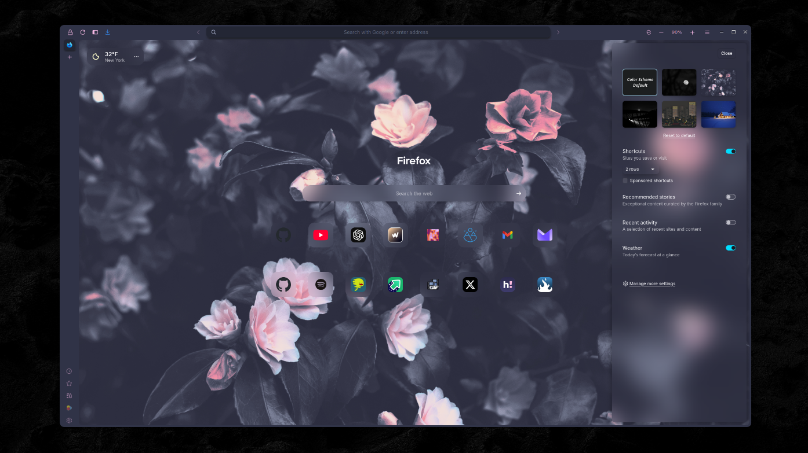

```
FF ULTIMA
Gruvbox Light Edition
This is a Light Mode Theme
By (credit yourself)
```

To use this color scheme:
- Navigate to `about:config` page.
- Search for `user.theme`.
- Turn on `user.theme.light.gruvbox`
- Make sure you only have one dark & light theme enabled at a time.
- Enjoy.

Preview:


Color schemes are easy to create: Learn how with the [New Color Scheme](https://github.com/soulhotel/FF-ULTIMA/wiki/Create-a-Color-Scheme) Wiki.
