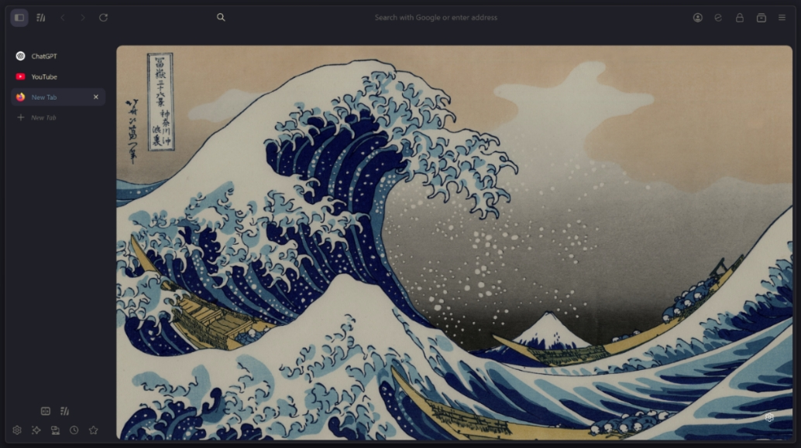
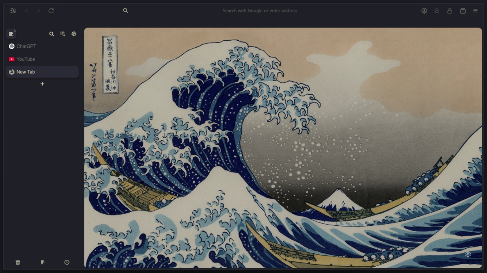

```
FF ULTIMA
Kanagawa Wave Edition
By Pitchaya S @pitchaya-s
```

To use this color scheme:
- Open `userChrome Companion`, in the `Color Scheme Settings` section.
- Turn on `theme.kanagawa-wave`

Preview:





Color schemes are easy to create: Learn how with the [Color Scheme](https://github.com/soulhotel/FF-ULTIMA/wiki/Create-a-Color-Scheme) Wiki.
