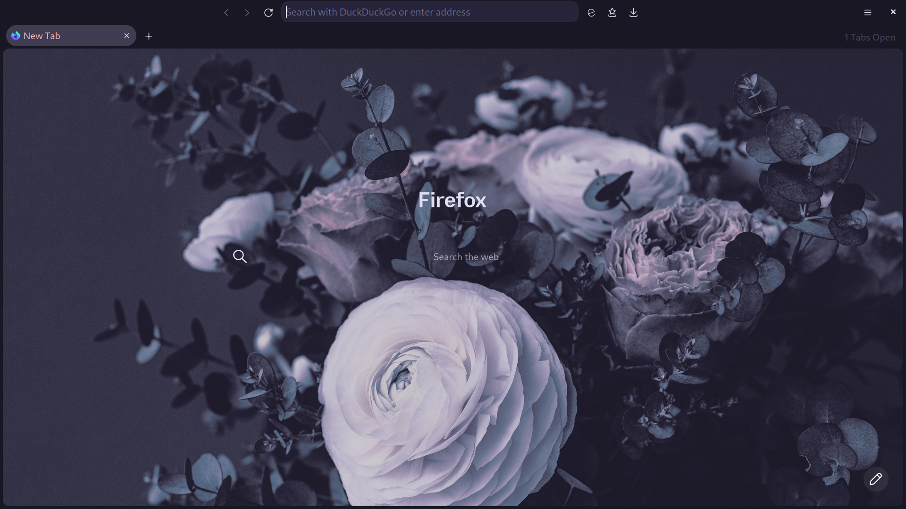
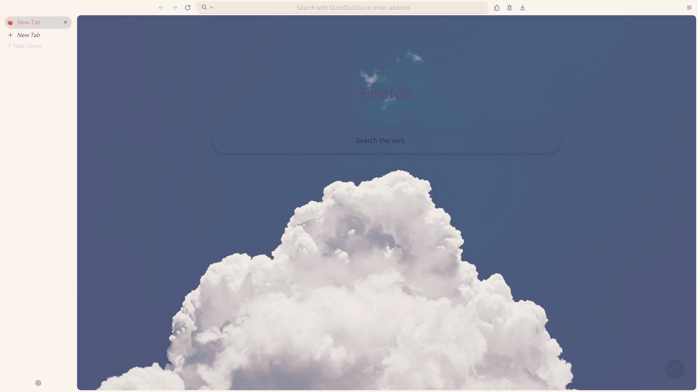

```
FF ULTIMA
Rosé Pine Edition
By neyfua https://github.com/neyfua
```

To use this color scheme:
- Navigate to `about:config` page.
- Search for `user.theme`.
- Turn on `user.theme.rose-pine`

Preview:



Color schemes are easy to create: Learn how with the [Color Scheme](/docs/color-schemes/create-a-color-scheme) Wiki.
