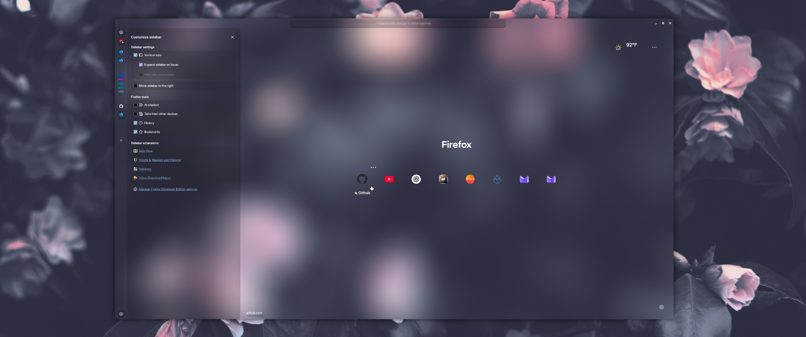

```
FF ULTIMA
Transparent Color Scheme
A Transparent Adaptive Color Scheme, adapted to support Mica & Blur
```

To use this color scheme:
- Open `userChrome Companion`, in the `Color Scheme Settings` section.
- Turn on `theme.transparent`
- Visit the Transparent Theme [Wiki](https://github.com/soulhotel/FF-ULTIMA/wiki/Transparent-Theming).

Preview:



Color schemes are easy to create: Learn how with the [Color Scheme](https://github.com/soulhotel/FF-ULTIMA/wiki/Create-a-Color-Scheme) Wiki.
